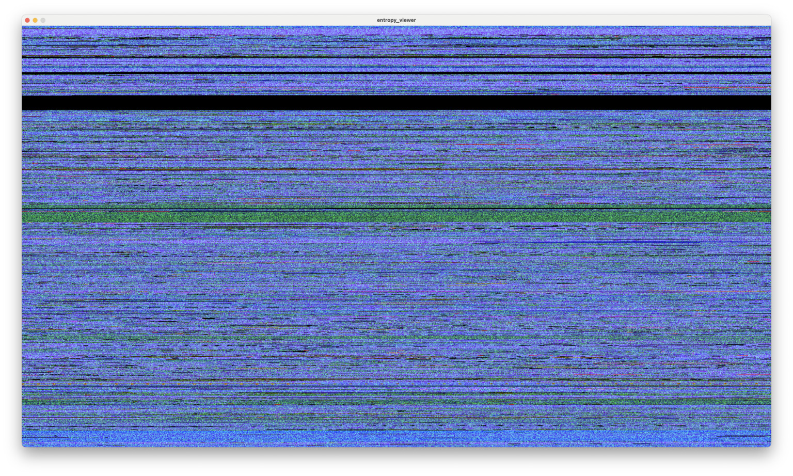

# entropy_viewer

Displays entropy read from stdin for a block of data represented one pixel at a time, using SDL2. 

By default, every 4096 bytes is one pixel.

Kind-of like [playfile](https://github.com/gm-stack/playfile) (which I wrote 14 years ago) - but looking at a 4K block at a time, not one pixel at a time.

Each pixel's colour is:

- red: average value of byte across block
- green: all bytes in block xor'd together
- blue: proportion of pixels in the block that are not 0

Written to see if a hard drive being recovered was still returning all zeros.

Supports drawing in normal mode (draw from left to right, top to bottom, then start again at top left), and waterfall mode (draw a line, then shift screen down).

## Screenshot



## Compilation

Requires `sdl2` and `pkg-config` installed.

```bash
clang main.c -o main `pkg-config sdl2 --cflags --libs`
```

## Usage

```
Usage: cat <file> | %s -w width -h height [-f fps] [-a] [-b size]\n"
			   "-w : window width in pixels\n"
			   "-h : window height in pixels\n"
			   "-f : FPS (default 60)\n"
			   "-a : draw in waterfall mode\n"
               "-b : buffer size per pixel (default 4096)"
```

```bash
cat somefile.img | ./main -w 1920 -h 1080
```

```bash
tail -f somefile.img | ./main -w 640 -h 480 -a -b 16384
```

## Todo

- Colour scheme could be configurable